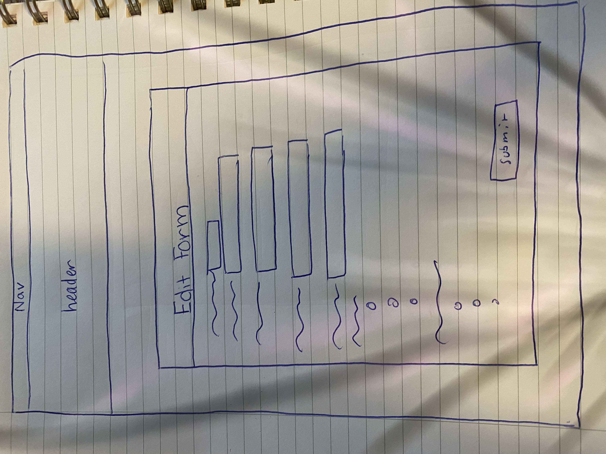

# Project 2: Design Journey

**For each milestone, complete only the sections that are labeled with that milestone.** Refine all sections before the final submission. If you later need to update your plan, **do not delete the original plan, leave it place and append your new plan below the original.** Explain why you are changing your plan. Remember you are graded on your design process. Updating the plan documents your process!

**Replace ALL _TODOs_ with your work.** (There should be no TODOs in the final submission.)

Be clear and concise in your writing. Bullets points are encouraged.

**Everything, including images, must be visible in Markdown Preview.** If it's not visible in Markdown Preview, then we won't grade it. We won't give you partial credit either. **Your design journey should be easy to read for the grader; in Markdown Preview the question _and_ answer should have a blank line between them.**


## Design / Plan (Milestone 1)

**Make the case for your decisions using concepts from class, as well as other design principles, theories, examples, and cases from outside of class (includes the design prerequisite for this course).**

You can use bullet points and lists, or full paragraphs, or a combo, whichever is appropriate. The writing should be solid draft quality.

### Audiences (Milestone 1)
> Who are your site's audiences?
> Briefly explain who the intended audiences are for your project website.
> **DO NOT INVENT RANDOM AUDIENCES HERE!** Use the audiences from the requirements.

_Consumer_: This audience for the website are parents/guardians/families who wish to learn more about the playful plants project. They are interested in providing high quality nature-rich places on a smaller scale around their homes and communities. They want to pick plants that will provide year-around interest or help to engage children in gardening projects. They would like to use the catalog website as a resource to view/shop/browse. Because they care about creating a nature-rich space and plan on gardening using this data, they need to know about the basic plant care: the hardiness zone, whether it’s an annual or perennial, the sun requirements, and the general type of plant (shrub, grass, vine, etc.)

_Site Administrator_: This audience for this website is the members of the playful plants project. They are a group dedicated to creating more outdoor play spaces for children to help them fully connect with the world and develop imaginative/divergent thinking skills. Plants are an important aspect to the Playful Plants project member's goals of creating such spaces so they would need a website like this catalog website I intend to create to find the appropriate plants for each section/theme they have in mind. This means that they would need to use the catalog to see which plants have specific attributes for their themes/goals and also need to add plants onto the digital database. While they may also be gardeners themselves, their goal isn’t to directly create gardens, but rather support the consumer audience who will create gardens.


### _Consumer_ Audience Goals (Milestone 1)
> Document your audience's goals.
> List each goal below. There is no specific number of goals required for this, but you need enough to do the job.
> **DO NOT INVENT RANDOM GOALS HERE OR STEREOTYPE HERE!** Your goals are things that your users want accomplish when using the site (e.g. print a list of plants). These are informed by the Playful Plants objectives. Review the assignment's requirements for details.

Goal 1: To browse database (at once) of playful plants that can support a range of nature play experiences.
- **Design Ideas and Choices** _How will you meet those goals in your design?_
  - I will create gallery from an SQlite database for the playful plants and  create a filtering/sorting feature based on various tags. My database would display the plants that satisfy each tag in a gallery.
- **Rationale & Additional Notes** _Justify your decisions; additional notes._
  - The audience needs a filtering feature because this allows the audience to select and view the information of the specific plants they want to look for that satisfy their needs as gardeners. This allows them to narrow down to specific plants that they are in need of and disregard the ones that they are not. The creation of a table that implements checkboxes help justify this goal as well because it is an easy way for the users of the website to understand that a plant contains an attribute.

Goal 2: To view ideas & plant collections for providing high quality nature-rich places on a smaller scale around their homes and communities. They want to pick plants that will provide year-around interest or help to engage children in gardening projects.
- **Design Ideas and Choices** _How will you meet those goals in your design?_
  - I will incorporate the use of tags that relate to gardening information
- **Rationale & Additional Notes** _Justify your decisions; additional notes._
When gardening you need to know about the basic plant care: the hardiness zone, whether it’s an annual or perennial, the sun requirements, and the general type of plant (shrub, grass, vine, etc.)

Goal 3: Needs to access the site with their mobile and computer devices.
- **Design Ideas and Choices** _How will you meet those goals in your design?_
- I will make the consumer aspect of the website fully responsive to small-width screens.
- **Rationale & Additional Notes** _Justify your decisions; additional notes._
Since phone screens and computer screens differ in their screen size, it is important that the consumers have a website that works for both.

Goal 4: To able to view a detailed version of an entry
- **Design Ideas and Choices** _How will you meet those goals in your design?_
- I will make a product page for each plant
- **Rationale & Additional Notes** _Justify your decisions; additional notes._
- The product page would give more detailed information about each plant and display all of the tags the plant has whereas the gallery page would not do so, inspite of the fact that it allows fltering, because this would make the page crowded with too much information and make the site messy to the user.


### _Consumer_ Persona (Milestone 1)
> Use the goals you identified above to develop a persona of your site's audience.
> Create your persona using GenderMag's customizable personas.
> Take a screenshot and include it here. Persona must be visible in Markdown Preview; do not use PDF format!


### _Administrator_ Audience Goals (Milestone 1)
> Document your audience's goals.
> List each goal below. There is no specific number of goals required for this, but you need enough to do the job.
> **DO NOT INVENT RANDOM GOALS HERE OR STEREOTYPE HERE!** Your goals are things that your users want accomplish when using the site (e.g. print a list of plants). These are informed by the Playful Plants objectives. Review the assignment's requirements for details.

Goal 1: To have a (searchable) database of playful plants that can support a range of nature play experiences.
- **Design Ideas and Choices** _How will you meet those goals in your design?_
  - I will create an SQlite database for the playful plants my lab section was assigned and create a filtering/sorting feature. My database would display the attributes each plant has with a check.
- **Rationale & Additional Notes** _Justify your decisions; additional notes._
  - The audience wants to have a search feature and a filtering feature because this allows the audience to select and view the information of the specific plants they want. This allows them to narrow down to specific plants that they are in need of and disregard the ones that they are not. The creation of a table that implements checkboxes help justify this goal as well because it is an easy way for the users of the website to understand that a plant contains an attribute.

Goal 2: To view ideas & plant collections for themed nature play spaces & gardens.
- **Design Ideas and Choices** _How will you meet those goals in your design?_
  - I will include appropriate information to help the audience find ideas for specific themes they have in mind and include a sort/filter option
- **Rationale & Additional Notes** _Justify your decisions; additional notes._
  - This allows for the audience to have a resource to refer to when implementing design choices for the playful plants project because they will be able to access information on each plant. The sorting and filtering option helps this goal additionally because it helps users narrow down to the plants they are looking for specifically which meets their theme's goals.

Goal 3: To add more to the digital database
- **Design Ideas and Choices** _How will you meet those goals in your design?_
  - Creating an *add plant* feature with the use of check buttons and a file upload section
- **Rationale & Additional Notes** _Justify your decisions; additional notes._
  - The add plant feature allows the audience to create additional inputs into the catalog in an effective way without having to manually enter things into a table. Check buttons make this much easier. The file upload is also an added requirement for the gallery website.

Goal 4: To view a digital database that is readable and understandable
- **Design Ideas and Choices** _How will you meet those goals in your design?_
  - I will use the common table schema of color-changing rows and use proper spacing between columns
- **Rationale & Additional Notes** _Justify your decisions; additional notes._
  - This helps the user differentiate between each row and column whilst implementing a website that is clean and fully readable.

Goal 5: To output adminsitrator only actions on the database
- **Design Ideas and Choices** _How will you meet those goals in your design?_
- I will create a login feature that allows them to view their own section of the website.
- **Rationale & Additional Notes** _Justify your decisions; additional notes._
- This helps them keep their aspect of the website secure from the consumers.

Goal 6: To delete items from the digital database.
- **Design Ideas and Choices** _How will you meet those goals in your design?_
- I will create a deletion feature for the website.
- **Rationale & Additional Notes** _Justify your decisions; additional notes._
- This allows the admins to delete things from sqlite without editing any code from DB.

### _Administrator_ Persona (Milestone 1)
> Use the goals you identified above to develop a persona of your site's audience.
> Create your persona using GenderMag's customizable personas.
> Take a screenshot and include it here. Persona must be visible in Markdown Preview; do not use PDF format!


### Site Design (Milestone 1)
> Document your _entire_ design process. **We want to see iteration!**
> **Show us the evolution of your design from your first idea (sketch) to the final design you plan to implement (sketch).**
> **Show us how you decided what data to display to each audience.**
> **Plan your URLs for the site.**
> **Provide a brief explanation _underneath_ each design artifact (2-3 sentences).** Explain what the artifact is, how it meets the goals of your personas (**refer to your personas by name**).
>
> **Important!** Plan _all_ site requirements. Don't forget login and logout.

_Initial Designs / Design Iterations:_

Please note: I did not design first and code any of these pages, I forgot to change the media and admin page on markdown because I had fibro fog but I designed them before I coded and used them as a mental reference. It is hard to work backwards, and I often look to update my designs so I sometimes leave the initial designs I had. I also do often truly enjoy tinkering with the designs so some of these are edited slightly, which I make mention of.

Thought Process:
For my media catalog, I was initially designing

The design I wanted to make for the catalog page was a filter on the side and the gallery display. This is so Abi could see all the plants as once with minimal scrolling on her desktop view. The phone view is the same but would display only one image at a time.


This design is the same but I wanted to include the names and genuses of the plants. I realized that the genuses did not look very good on the page though, so I ended up discarding that feature. I kept the design simple so that Abi would not be too oversimulated with information.


The design I made for the individual plant page displayed each plant, discription, and related tags for the users to see. This is so Abi views everything at once about the plant.

I now realize that design doesnt work so I will be changing it to

This design removes the cost button which I realized is not even necessary for this project. It keeps the values and images and description of the plant in a border that would be both eye appealing and simplistic, perfect for Abi not only in terms of aesthetic but also in terms of functionality because she wants a website that gives such information about each of the plants

The initial design I had for the administrator page was the table layout I had in project two, but I completely discarded that

The later on design I had for the administrator page was a filter/sort on the side and the plant information scroll panel. In this design I included buttons for the edit page and to delete an image because I wanted to make sure that only the admins could access these page and I wanted it to be easier for them to change any plants they wanted specifically just by clicking the link. I ended up adding a feature onto this page-- the add plant button. I realized it made more sense next to the title. I removed it from the nav-bar. I also ended up removing the add data table because I was actually having an error when implementing it side by side as I had in an earlier design plan:

This initial design is what I submitted on my first milestone, which I now obviously have to discard because it doesnt have the basic edit or delete forms as well as the add form on the same page.

Because of a bug, I decided to recreate an add-data page which I did, it closely mimics the edit page I also wanted to create. Both would cue the admin to well known feedback messsages if certain values are empty and display a confirmation message as soon as the forms successfully worked. There is an issue though, so I want to change this design as well, it is mainly the CSS I copied from my project 2.



I realized that these pages are literally exactly the same so I wanted to work harder and create a design that was somehow more complicated. This is why I created this page:

This design copies stereotypical form designs seen on input forms such as contact forms and places some content side by side. I actually don't know if this design would even look good either, I have to test it out because I am worried that the buttons would look bad side by side. Regardless, this is not a strict design, just a tool I want to use as a reference. I will likely end up tinkering with the design and place the text forms next to eachother too.

I just want Abi to have a website that is highly visually appealing and copies from familiar form css styling so that she has the appropriate visual cues and takes the website seriously.


I kept the login page simple because I knew that this would be something Abi is very familiar with. I want to make the title "Admin Logn" instead of welcome though because it makes more sense. My admin has Tim's cognitive persona so I feel like they would be able to understand and work with it.


_Final Design:_


### Design Pattern Explanation/Reflection (Milestone 1)
> Write a one paragraph (6-8 sentences) reflection explaining how you used design patterns for media catalogs in your site's final design.

I used seedsavers as a sample website to mimic when creating this website. I wanted to make sure that Abi understood the mission of the website as well as the catalog so I included both on the about us page, which I made the home page. I wanted the catalog to be simple so I made the catalog a gallery with the filters on the side so Abi can sort through the data and find the plants that suit her needs. I also included this filter section on the catalog nav option because I wanted her to have two ways to filter through the plants and see the various listing options. I wanted to create a login page for Tim so that he could login directly and the admin page right next to it at the top of the header so that it could both stand out for him as well as fit the same design pattern as companies like Amazon or Seedsavers in the way that they have their login settup.

### Cognitive Styles Explanation/Reflection (Milestone 1)
> Write a one paragraph (6-8 sentences) reflection explaining how your final design supports the cognitive styles of each persona.

_Consumer Cognitive Styles Reflection:_
Because Abi is a person who needs to see everything first before taking computer actions, I tried to make the consumer aspect of the website relative simple and easy to navigate. The about us page, whilst including information about the Playful Plants Project and its mission, contains therefore various links to the shop itself. The catalog navigation option also has the same feature and has quick links to the various filters. I want to make sure that Abi sees all the information about each of the various plants when she clicked on the image. For this reason, I made sure to have all the tags and plant information on the individual plant page, as if it were a page on amazon.


_Site Administrator Cognitive Styles Reflection:_

Because Tim is a person who has a selective way of navigating through websites by taking steps first and then assessing if he gets wrong, and a high level of confidence on his computer skills, the implementation of the website design is catered to his need because the admin only page is at the top of the website and as you click on it you have to login, which implies to him that he needs to log in first before he sees the page. When looking at the database catalog for his end of the website he is able to see all aspects of each plant with the new layout for the database, which is supportive of images as well.


## Implementation Plan (Milestone 1, Milestone 2, Milestone 3, Final Submission)

### Database Schema (Milestone 1)
> Describe the structure of your database. You may use words or a picture. A bulleted list is probably the simplest way to do this. Make sure you include constraints for each field.
> **Hint: You probably need a table for "entries", `tags`, `"entry"_tags`** (stores relationship between entries and tags), and a `users` tables.
> **Hint: For foreign keys, use the singular name of the table + _id.** For example: `image_id` and `tag_id` for the `image_tags` (tags for each image) table.

Table 1: Admin only
- field1: Integer plant_id (AI, PK, NN, U)
- field2: TEXT plant_name (Colloquial)(U, NN)
- field 3: TEXT plant_genus (Genus, Species) (U,NN)
- field 4: INT s_ecp- Supports Exploratory Constructive Play (U,NN)
- field 5: INT s_esp- Supports Exploratory Sensory Play (NN)
- field 6: INT s_pp- Supports Physical Play (NN)
- field 7: INT s_ip- Supports Imaginative Play (NN)
- field 8: INT s_rp- Supports Restorative Play (NN)
- field 9: INT s_ep- Supports Expressive Play (NN)
- field 10: INT s_pwr- Supports Play with Rules (NN)
- field 11: INT s_bp- Supports Bio Play (NN)
- field 12: INT p_vi- Provides Visual Interest (NN)
- field 14: INT p_lppp- Provides Loose Parts Play Props (NN)
- field 13: INT o_cs- Provides Opportunities for Climbing and Swinging (NN)
- field 15: INT c_nss- Creates Nooks or Secret Spaces (NN)
- field 16: TEXT image- plant image (nn)

tags {
  id: INTEGER {AI, U, NN, PK}
  tname: TEXT {NN, U}
}

tag_plants {
  id: INTEGER {AI, U, NN, PK}
  tag_id references foreign key tags(id)
  plant_id references foreign key plants(id)
}

users {
  id: INTEGER {AI, U, NN, PK}
  username: TEXT {NN, U}
  password: TEXT {NN, U}
}


### Database Query Plan (Milestone 1, Milestone 2, Milestone 3, Final Submission)
> Plan _all_ of your database queries. You may use natural language, pseudocode, or SQL.

  1. All Records (Milestone 2)
      ```
      browse-plants:
      SELECT * FROM plant_data
      $result->fetchAll();
      label each th column fully
      echo Plant Name
      echo Plant Genus
      for each of the remaining tables (echo name if yes, add commas if others are present with , or and in between

      browse-plants:
      query image for each plant

      ```

  2. Filter/Sort/Edit Records (Final Submission)

      ```
      If form 2 not valid:
        display sticky value of either filter or sort (whichever is empty) and error message

      Filter section of form3 :
      When form submitted and valid,
        show filters at the top of the page with ',' in between when >1
        Hold every filter that has a value of true in an array, query db
        Display filter after submitted in box
        show sticky values

      Sort section of form3:
      When form submitted and valid ,
        show sort at the top of the page
        Since it only makes sense for there to be one sort, hold it in one variable
        Display filter after submitted in box
        query db
        show sticky values

      Edit form:
      Two queries-- one for records initially and another one for the values recieved from the edit-id
      Class value query similar to single page query
      Enter a new tag query
      SELECT MAX(id) from Tags and save to enter new tag value if it is a new tag that is being either edited in or added in

      ```

  3. Insert Record /filter by tags(Final Submission)

      ```
      Get id, name, genus
      Hold each attribute as a boolean
      If the boolean is true, make the attribute a 1, otherwise set it as a 0
      If the form is valid,
      insert into plant data all the values and use the : to check for harmful inputs
      otherwise show sticky values
      to insert an image use all of the steps learned in class, set file max sile, enctype


      to filter by tags my plan is
      1. make an array of all the tags
          first query here


      ``


### Code Planning (Milestone 1, Milestone 2, Milestone 3, Final Submission)
> Plan any PHP code you'll need here using pseudocode.
> Tip: Break this up by pages. It makes it easier to plan.

```
take away table layout and make list layout
move css filtering and adding
change add data table to include all attributes
change add data table to include file uploads
query individual pages for each plant
make media catalog
make user login


```

```
Add data form update:
Allow for uploads, set maxwidth, enctype, form value, post request get from uploads on files, set id to new id, move to proper folder

Filter update:
make buttons for classes and (radio) life span, as well as drop down for hardiness

Edit Form: copy everything from the add data form but have different values for the initial request. Use httpbuildquery to get page.
Edit Form: entering new tags:
first insert new tag into tags and then use value for class given onto plant_tags, do this only if the tag is not one of the three we already have. Find max(id) for tags

Delete form: delete tag from plant_tags only

Filter form:
      to filter by tags my plan is
      1. make an array of all the tags from table tags
          first query here
      2. for each tag as key value make a sort input statement (thank God I know java and feel more familiar with this)
            $Value would be the name and id and $stickyValue would have to be set to is $Value checked or nah
      --welp, that worked out well but it broke my css
      ---edit the extra /div did this and i fixed it yay
            $tag would store the tag input
            $tagid= would be $key + 1 bc it starts with 0
      3. if $tag == $value
          // ex, if $tag == moss
          JOIN QUERY here
          "SELECT
          plant_data.id AS 'plant_data.id',
          tags.id AS 'tags.id'
          FROM
          plant_data
          INNER JOIN plant_tags ON (plant_tags.plant_id == plant_data.id)
          INNER JOIN tags ON (plant_tags.tag_id == tags.id)
           WHERE plant_tags.tag_id = :plant_id;",
      4. second for-loop, would this work? idk lol
          for each $workableplid
          "SELECT * from plant_data WHERE id=" $workableplids
          query this
          Bam u done sis
          how do i actually do this tho
     i m scared but its ok atleast every other form works so i wont get a 0
          #this is evidence that i am not cheating please dr harms i am doing something that wasnt even taught but a TA told me  for loops worked for this and suddenly I was like "oh wow, why didnt I think of that ugh" I would appreciate extra points for this because with this method all new tags can be shown on the form ! supports multiple tagging too.
```
Sessions planning:


### Accessibility Audit (Final Submission)
> Tell us what issues you discovered during your accessibility audit.
> What do you do to improve the accessibility of your site?

I was missing some form labels for the admin page, so I added those. I had the same issue on my home page because what happened was that I copied and pasted the forms for my other forms and so i had the same exact labels and forgot to fix them, so I quickly changed those too.


## Reflection (Final Submission)

### Audience (Final Submission)
> Tell us how your final site meets the goals of your audiences. Be specific here. Tell us how you tailored your design, content, etc. to make your website usable for your personas.

The final site meets the goals of the audience because it displays a website for both Tim (admin) and Abi (user) that is beautiful, functional, and easy to use. All of the forms on the website work and the filters are ok. The website is designed in a way where the Tim and Abi have relative ease because there is the familiar filter | content layout that alot of shops use on the home and admin page, and the  admin page is designed in a way where everything is there at once. Every individual page for the website properly displays the information about each plant type for Abi to see as she selects the proper gardening plants for her needs. The website is tailored towards her because it uses childish colors which emphasize the website's goals as serving concerned parents that their children aren't getting enough time outside. Even the graphics of each unknown plant image is childish for this same reason, this is a page that works to serve the needs of children and those that work to serve them as well.


### Additional Design Justifications (Final Submission)
> If you feel like you haven’t fully explained your design choices in the final submission, or you want to explain some functions in your site (e.g., if you feel like you make a special design choice which might not meet the final requirement), you can use the additional design justifications to justify your design choices. Remember, this is place for you to justify your design choices which you haven’t covered in the design journey. You don’t need to fill out this section if you think all design choices have been well explained in the design journey.

I am running very short of the time left for this submission and had a hard time making the filters because I was a bit confused and I also experienced confusion/headaches from fasting all day long because of Ramadan, so I wasnt able to think and act in the best way, especially because of fibromyalgia confounding on all of this. Regardless, I am going to try to implement the sites design and filter to the best of my ability because the deadline is in thirty minutes. I do not believe that I have any bugs in my code after testing it out except for in the filters because I cannot filter with multiple tags in the way I wanted because I used "or" and didn't use radio buttons.

Regardless, I have yet been unable to design the login pages or add/edit forms to the extent that I wanted to because I am running very short on time.


### Self-Reflection (Final Submission)
> Reflect on what you learned during this assignment. How have you improved from Project 2? What would you do differently next time?

This assignment taught me a few things-- one I actually very much love design and that I am decent at programming. I cant believe I used for each loops to make the buttons for the classes all display in a way where I allow for new tags to be added, I think I did a really good job with that because this is not something I learned in class, just something I felt randomly inspired to do. After I saw Dr. Harm's feedback for project 2, I realized what "code copying" really meant in the future for me, I justified it earlier because I did believe that it helped me learn given my circumstances but I didn't understand what the underlying harm was. After understanding that fibromyalgia is not an excuse to copy code, I coded everything on my own and realized that this method did help me learn more, and learn much faster so this is truly what I aimed to do this project and thankfully it worked out great. I thought that fibromyalgia did give me the right to copy code before because to me it was just my method of minimizing the physical pain I would experience everytime I started working. This is because fibromyalgia flares when we do mundane things, and sadly for me, it flares when I do important things like school related work. This is why I made that mistake earlier, and I truly believed that I was justified because I am simply trying to minimize my pain, especially because I was still learning the material like everyone else. My perspective however, changed after I contacted Dr. Harms and read the feedback he gave on my project 2. I realized that I was setting myself up for failure in terms of my career related goals so I completely refrained from making the same mistake again.
I did not code the sessions stuff on my own though, obviously. I truly believe that I tried my best even though I wanted to implement more stuff like fixing the filters and adding multiple tags. I hope that in spite of the small bugs I may have, I get a decent grade.


> Take some time here to reflect on how much you've learned since you started this class. It's often easy to ignore our own progress. Take a moment and think about your accomplishments in this class. Hopefully you'll recognize that you've accomplished a lot and that you should be very proud of those accomplishments

I used to be scared of coding because I felt like I didnt understand how to do it and needed my hand held, but then I realized that I too have good ideas that I could implement if I actually understood how to properly query the database, so when I learned that everything became much easier. I am also very proud of my website because now I know that I can make programs and websites for shops that I want to start or my friend's initiatives, etc.

Last semester had been horrible for me when I took CS2110, but here I surprised myself by coding something that other students thought was impossible because I followed my intuition and remained patient. Sometimes I doubt myself but the fact that I somehow implemented these novel things that were not included in any practice labs or references we had make me feel like I am actually not as incompetent as I sometimes think I am inspite of my hardships.


### Grading: Step-by-Step Instructions (Final Submission)
> Write step-by-step instructions for the graders.
> The project if very hard to grade if we don't understand how your site works.
> For example, you must login before you can delete.
> For each set of instructions, assume the grader is starting from /

_View all entries:_

0. login with username= admin and password= monkey
1. go to home page or
2. go to administrative database or
3. open init

_View all entries for a tag:_

1. my tags are the classes, you can view all entries on the classes by selecting an option from "Classes" on my filter and pressing submit

_View a single entry's details:_

1. click on the links or images on home page
2. click on the links on the administrative database that are on the plant's names

_How to insert and upload a new entry:_

0. login with username= admin and password= monkey
1. click on the add form that is next to the plant data catalog title
2. enter values and upload an image then press submit

_How to delete an entry:_

0. login with username= admin and password= monkey
1. click on the trash icon next to every plant info
2. click "ok" on the "are you sure" message

_How to edit and existing entry and its tags:_

0. login with username= admin and password= monkey
1. click on the pen thing next to each entry
2. enter values and upload an image then press submit
